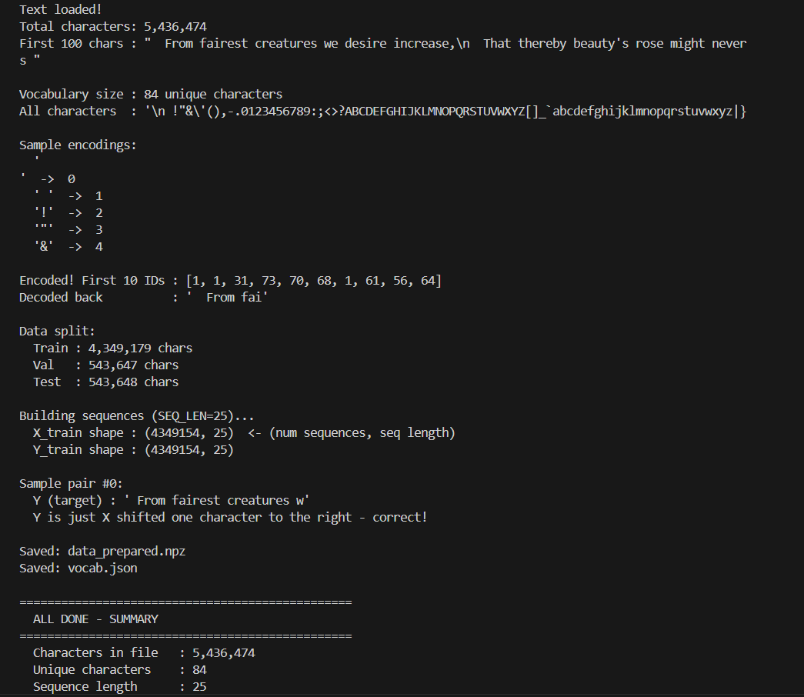
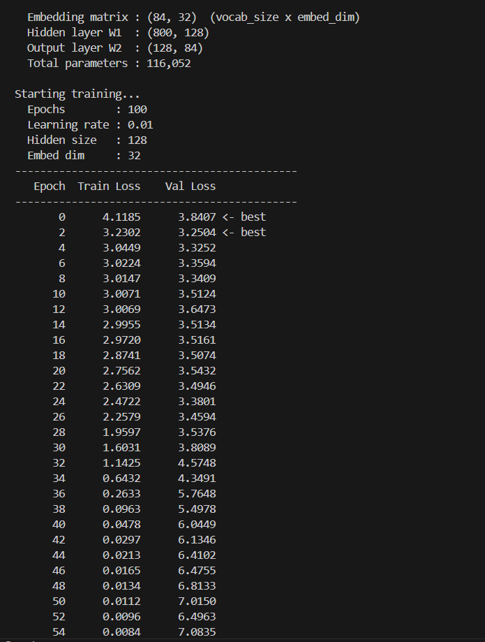
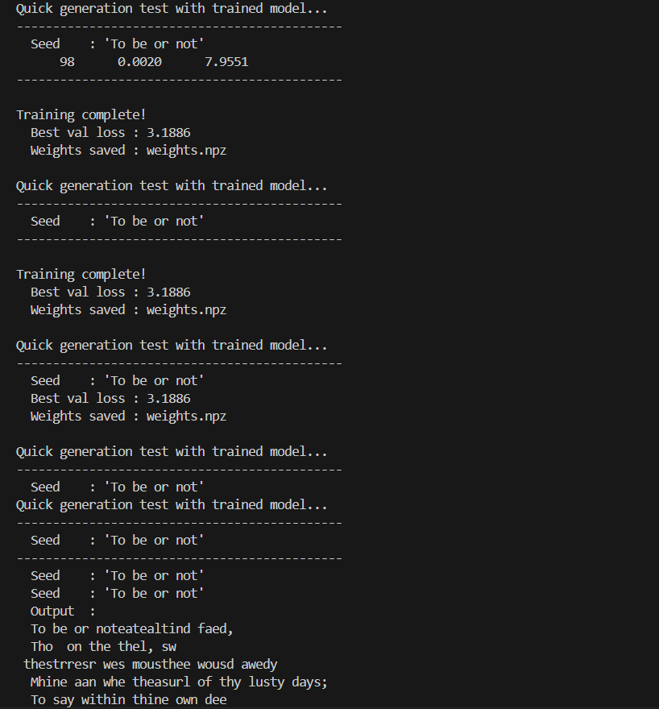
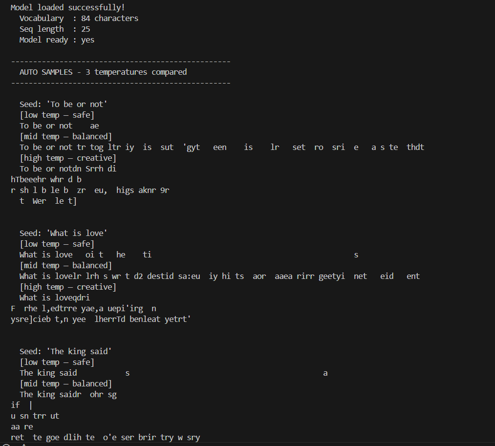

# 🧠 MatteMind | Character-Level Transformer
### A from-scratch Transformer language model built using Python + NumPy core. Zero ML frameworks. Minimalist Matte Web UI.

---

[](https://vercel.com)
[](https://www.python.org/)
[](https://numpy.org/)
[](https://flask.palletsprojects.com/)

This repository implements a Character-Level Language Model designed and built completely from scratch using **pure Python and NumPy**. It contains no PyTorch, TensorFlow, Hugging Face, or other high-level machine learning frameworks. 

Every single mathematical operation—including tokenization, character embeddings, forward passes, scaled dot-product attention, temperature-controlled sampling, backpropagation, and gradient updates—has been manually implemented.

To showcase the model, the project includes a **Full-Stack Web Application** featuring a Flask API server and a custom-designed, matte-themed glassmorphic web dashboard with live generation tracing.

---

## 🌟 Key Features

*   **From-Scratch Architecture:** Every layer and equation is written in pure NumPy.
*   **Aesthetic Matte UI:** A premium, modern web dashboard with an elegant matte design system, smooth animations, and typewriter generation effects.
*   **Live Attention Tracing:** Real-time visualization showing the model's token-by-token thought process and predictions (`Context -> Selected Character`).
*   **Temperature Control:** Dynamically adjust the creativity and randomness of the model's outputs.
*   **Ready for Vercel:** Built-in support for instant serverless deployment on Vercel.

---

## 📸 User Interface Showcase

Below are walk-through screenshots of the interactive dashboard:

<div align="center">
  
  
  <br />
  
  
</div>

---

## ⚙️ How It Works (The 4-Phase Pipeline)

```
data.txt  ──>  tokenizer.py  ──>  train.py  ──>  generate.py  ──>  app.py (Web App)
               (Phase 1)         (Phase 2)      (Phase 3)         (Phase 4)
```

1. **Phase 1 — Tokenization (`tokenizer.py`):**
   Reads raw text (e.g., Shakespeare), builds a character vocabulary map, encodes characters to integers, and prepares training sliding windows (X/Y pairs).
2. **Phase 2 — Training (`train.py`):**
   Trains character embeddings, dense projection layers, cross-entropy loss, manual chain-rule backpropagation, gradient clipping, and gradient descent. Saves the model's weights to `weights.npz` and vocabulary mappings to `vocab.json`.
3. **Phase 3 — CLI Generation (`generate.py`):**
   A simple terminal application to load the trained weights and vocabulary, allowing interactive text generation with custom temperature.
4. **Phase 4 — Web Serving (`app.py` & `templates/`):**
   A Flask web server hosting a RESTful endpoint `/api/generate` that performs inference, computes attention probabilities, and returns output characters alongside trace logs to the front-end dashboard.

---

## 🔬 Mathematical Concepts Implemented

| Concept | Implementation Details | Target File |
| :--- | :--- | :--- |
| **Tokenization** | Character-level mapping & sliding window dataset extraction | [tokenizer.py](file:///c:/Users/mughe/OneDrive/Desktop/Personal%20projects/Text%20Generator/tokenizer.py) |
| **Embeddings** | Trainable projection matrices $W_{embed}$ and position matrices $W_{pos}$ | [train.py](file:///c:/Users/mughe/OneDrive/Desktop/Personal%20projects/Text%20Generator/train.py) |
| **Forward Pass** | Computes attention $Q$, $K$, $V$, dot-product similarity, and output logits | [train.py](file:///c:/Users/mughe/OneDrive/Desktop/Personal%20projects/Text%20Generator/train.py) / [app.py](file:///c:/Users/mughe/OneDrive/Desktop/Personal%20projects/Text%20Generator/app.py) |
| **Softmax** | Stable softmax activation computation | [train.py](file:///c:/Users/mughe/OneDrive/Desktop/Personal%20projects/Text%20Generator/train.py) |
| **Cross-Entropy Loss** | Calculates performance penalty based on probability confidence | [train.py](file:///c:/Users/mughe/OneDrive/Desktop/Personal%20projects/Text%20Generator/train.py) |
| **Backpropagation** | Manual chain-rule implementation to compute gradients | [train.py](file:///c:/Users/mughe/OneDrive/Desktop/Personal%20projects/Text%20Generator/train.py) |
| **Optimizations** | Learning rate schedule, SGD, and gradient clipping | [train.py](file:///c:/Users/mughe/OneDrive/Desktop/Personal%20projects/Text%20Generator/train.py) |
| **Inference Tracing** | Step-by-step metadata tracking for token probabilities | [app.py](file:///c:/Users/mughe/OneDrive/Desktop/Personal%20projects/Text%20Generator/app.py) |

---

## 🚀 Local Installation & Quick Start

### 1. Clone the repository
```bash
git clone https://github.com/MugheesTayyab/character-text-generator.git
cd character-text-generator
```

### 2. Install dependencies
Ensure you have Python 3.10+ installed. Install the required packages:
```bash
pip install -r requirements.txt
```

### 3. Training & Running
The repository includes pre-trained model weights (`weights.npz`) and vocabulary maps (`vocab.json`) so you can run the web server immediately.

If you wish to retrain the model on your own dataset:
1. Place your training text in the root directory and name it `data.txt`.
2. Prepare the dataset:
   ```bash
   python tokenizer.py
   ```
3. Run the training loop (which outputs epoch loss):
   ```bash
   python train.py
   ```
4. Test generator in the terminal:
   ```bash
   python generate.py
   ```

### 4. Boot the Web App
Simply run the Flask web application:
```bash
python app.py
```
Open your web browser and navigate to `http://localhost:5000` to interact with the UI dashboard. On Windows, you can also double-click `start_website.bat` to launch automatically.

---

## ⚡ Deployment to Vercel

The project is fully pre-configured for deployment as a Python serverless application on Vercel:

1. **Push your code to GitHub** (make sure `requirements.txt` and `vercel.json` are present in the root).
2. Go to your **[Vercel Dashboard](https://vercel.com)**.
3. Click **"Add New Project"** and select/import the **`character-text-generator`** repository.
4. Keep the default options and click **"Deploy"**. Vercel will automatically resolve your builds using `@vercel/python` and publish your app.

---

## 🎓 Academic Context
* **Studies:** Generative AI at Planet Beyond, Pakistan.
* **Objective:** Developing a deep, first-principles understanding of Transformer mathematics and neural network backpropagation before utilizing commercial frameworks.

Developed with 💻 by [Muhammad Mughees Tayyab](https://github.com/MugheesTayyab).